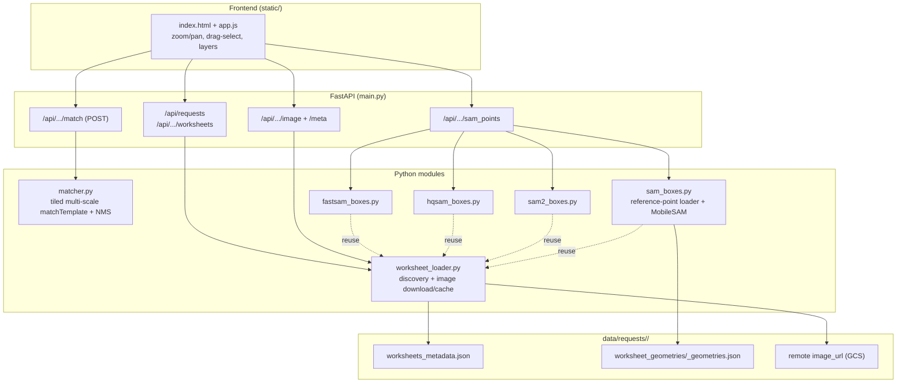

# Symbol Matcher — Complete Pipeline

End-to-end documentation of the worksheet symbol-detection system: how a request
image is loaded, how a user-selected symbol is matched everywhere, and how the
SAM family (FastSAM / HQ-SAM / SAM 2.1 / MobileSAM) turns annotated reference
points into per-symbol boxes.

---

## 1. Overview

The tool lets you:

1. Pick a **request** (`rid`) and a **worksheet** (`wid`).
2. Load the worksheet raster (downloaded from its remote `image_url`).
3. **Drag a box** around a symbol → every visually similar patch is highlighted
   (classical template matching).
4. Or run a **SAM model** on the worksheet's annotated reference points → one
   tight bounding box per symbol.
5. Toggle result **layers** on/off to compare methods.

Two independent detection paths:

| Path | Prompt | Engine | Output |
|------|--------|--------|--------|
| **Template matching** | a drag-selected patch | `cv2.matchTemplate` (multi-scale, tiled, NMS) | all similar patches |
| **SAM box-finding** | reference points from geometries | FastSAM / HQ-SAM / SAM 2.1 / MobileSAM | one box per symbol |

---

## 2. Architecture



---

## 3. Data layout

```
data/requests/<rid>/
  worksheets_metadata.json          # list of worksheets; each has id, name, page_no, image{width,height,image_url}
  worksheet_geometries/
    <wid>_geometries.json           # annotated features incl. Point reference points
models/
  FastSAM-s.pt                      # FastSAM weights (auto-download)
  sam2.1_s.pt                       # SAM 2.1 small (auto-download)
  sam_hq_vit_tiny.pth               # Light HQ-SAM weights
  mobile_sam.pt                     # MobileSAM weights (optional)
symbol_matcher_app/.image_cache/    # decoded PNGs, keyed by <rid>__<wid>.png
```

---

## 4. Setup & run

Uses the existing `.envs/vsam` environment.

```bash
# from repo root — install deps into the vsam env
uv pip install --python .envs/vsam/bin/python -r symbol_matcher_app/requirements.txt

# run the server (from symbol_matcher_app/)
cd symbol_matcher_app
../.envs/vsam/bin/uvicorn main:app --reload --port 8000
# open http://127.0.0.1:8000/
```

Model weights are downloaded on first use (FastSAM, SAM 2.1) or expected in
`models/` (HQ-SAM, MobileSAM). SAM models are **lazy-loaded** — importing the
heavy libs only happens the first time that model is requested, so startup and
template matching stay fast.

---

## 5. Stage 1 — worksheet discovery & image loading

Module: `worksheet_loader.py`

1. **Discovery** — `list_requests()` scans `data/requests/*` for folders with a
   `worksheets_metadata.json`. `list_worksheets(rid)` returns every worksheet
   that exposes an `image_url`, each tagged with:
   - `has_geometry` — whether a `<wid>_geometries.json` exists,
   - `page_no`, `width`, `height`.
   The list is **sorted geometry-first, then by page number**, so annotated
   sheets surface at the top of the searchable dropdown.
2. **Image load** — `load_worksheet_image(rid, wid)` returns a BGR `uint8` array.
   The raster is downloaded once from `image_url` (via `requests` + `PIL`),
   converted to BGR, and cached to `.image_cache/<rid>__<wid>.png`. Subsequent
   loads read the cache.
3. **Serving** — `/image` streams the cached PNG; `/meta` returns pixel
   `width`/`height` (the frontend needs these to map screen ↔ image coords).

---

## 6. Stage 2 — template matching

Module: `matcher.py` · Endpoint: `POST /api/worksheet/{rid}/{wid}/match`

Input: the drag-selected rectangle (`x, y, w, h` in **original** image pixels)
plus a `threshold`. The server crops that patch as the template and runs
`match_template`, which is **multi-scale + tiled + NMS**:

1. **Downscale guard** — image + template are scaled together so the longest
   side ≤ `max_image_dim` (2500 px). Results are mapped back to full resolution
   at the end. Keeps large sheets (~7000×5000) fast.
2. **Multi-scale templates** — the template is pre-resized to scales
   `[0.8, 0.9, 1.0, 1.1, 1.25]` once and reused for every tile.
3. **Tiling** — the working image is split into overlapping tiles
   (`tile_size` ≈ 1024). Overlap ≥ largest template + margin, so a symbol on a
   tile boundary is still whole in some tile. Tiles run in parallel
   (`ThreadPoolExecutor`).
4. **Correlation** — per tile, `cv2.matchTemplate(..., TM_CCOEFF_NORMED)`; pixels
   ≥ `threshold` become candidate boxes (offset back to working coords).
5. **NMS** — greedy non-maximum suppression (`iou_thresh` 0.3) merges
   overlapping detections across all tiles; survivors are rescaled to original
   pixels.

Output: `{ count, template, matches: [{x,y,w,h,score}] }`.

---

## 7. Stage 3 — reference points (electrical filtering)

Module: `sam_boxes.py` → `load_reference_points(rid, wid, img_w, img_h)`

The SAM paths are **point-prompted** from the worksheet's own annotations:

1. Open `<wid>_geometries.json`, iterate `outputs[].feature`.
2. Keep only **`geometry_type == 1` (Point)** features — the same "electrical"
   filtering used in the EDA notebooks.
3. Map each point from **Feathers canvas coords** to raster pixels:
   - Feathers coords are `[x, y]` on the `image.width × image.height` FE canvas,
     with **y negative (y-up)**.
   - Scale by `sx = img_w/fe_w`, `sy = img_h/fe_h`, and **flip Y** via `abs(y)`.
4. Drop points outside the raster. Return `RefPoint(x, y, name)` list.

These points are the prompts for every SAM model below.

---

## 8. Stage 4 — SAM box-finding

Endpoint: `GET /api/worksheet/{rid}/{wid}/sam_points?model=<...>&limit=N`

All non-legacy SAM paths share a **crop-wise** strategy, because sheets are huge
and symbols are tiny: running a whole-sheet model downscales symbols to a few
pixels and produces loose masks. Instead we cut a small window around each
reference point so the symbol fills the patch.

### Shared recipe (FastSAM / HQ-SAM / SAM 2.1)

For each reference point:

1. **Adaptive crop** *(HQ-SAM, SAM 2.1)* — window half-size is shrunk toward the
   nearest neighbouring reference point: `crop ≈ 0.75 × nn_distance`, floored at
   `min_crop`, capped at `crop` (90). In dense grids this excludes neighbours;
   FastSAM uses a fixed `crop`.
2. **Optional preprocessing** *(when `sharpen=1` and/or `pseudocolor=1`)* — the
   crop fed to the model is first sharpened (unsharp mask) and/or replaced by a
   multi-scale per-channel Gaussian pyramid (see *Preprocessing* below); the
   original crop is still used for the fallback and all coordinates.
3. **Model inference** on the crop.
4. **Candidate selection** — keep masks that (a) cover the point, (b) aren't
   background-sized (`< max_box_frac × crop_area`); prefer masks within
   `max_symbol_px`, then higher score, then smaller.
5. **Finalize** — add `pad`, floor the box to `min_symbol_px`, clamp to image
   bounds.
6. **Fallback** — if no mask is found, a dark **connected-component** box under
   the point is used (`source = "cc"`).

### Preprocessing — `pseudocolor.py` (optional, all three SAM paths)

Two independent, combinable preprocessors sit between the crop and the model.
Both change **only what the model sees** — the connected-component fallback and
all box coordinates keep using the original image. When both are on, sharpen is
applied first, then the glow.

**Sharpen** — `pseudocolor=0`, `sharpen=1` (UI: **Sharpen** checkbox). An
unsharp mask (`sharpen(image, amount=1.5, radius=3)`) with a deliberately
aggressive `amount` so razor-thin strokes pop for SAM.

**Glow pseudo-color** —
SAM-family models are trained on natural photos and struggle with razor-thin,
1-px monochrome CAD lines. With `pseudocolor=1` (UI: the **Pseudo-color**
checkbox, default off) each crop is turned into a colourful
"chromatic-aberration" image before inference by blurring each channel with a
different Gaussian kernel ("glow" mode, `invert=True`):

- **Red** (high freq): tight `3×3` → sharp structural boundaries
- **Green** (mid freq): medium `7×7` → local structural context
- **Blue** (low freq): wide `13×13` → broad gradient "glow"

Merging the channels gives a coloured gradient halo around every line that
SAM's patch-attention perceives like natural depth/lighting. The full image is
blurred once per request (only when enabled), and only the model *input* is
pseudo-colored — the connected-component fallback and all box coordinates keep
using the original image, so geometry is unaffected. Kernels are fixed at
`(3, 7, 13)`.

### FastSAM — `fastsam_boxes.py` (default, cyan)

- YOLOv8-seg "segment everything" on the crop, then union masks covering the
  point that are near the **median** mask size (`size_ratio`), merging fragmented
  strokes while dropping an oversized enveloping mask. If the union exceeds
  `max_symbol_px`, fall back to the smallest covering mask. Fastest.

### HQ-SAM — `hqsam_boxes.py` (magenta)

- Light HQ-SAM (`vit_tiny`, high-quality mask head). Dense-region tuned:
  - **adaptive crop** (above),
  - neighbouring reference points fed as **negative** prompts,
  - a **refinement pass**: pass-1 (positive point, `multimask_output=True`)
    proposes a mask; pass-2 feeds its logits back with the negatives
    (`multimask_output=False`) to sharpen the boundary.
- Weights loaded with `map_location="cpu"` so a CUDA-saved checkpoint runs on
  MPS/CPU. Crisper on thin symbols; ~0.15 s/point.

### SAM 2.1 — `sam2_boxes.py` (amber)

- SAM 2.1 Hiera-small via **Ultralytics** — the SAM-family model that runs on
  Apple **MPS**, used as the Mac-friendly stand-in for SAM 3. Same adaptive-crop
  + neighbour-negative recipe. Heaviest (~0.47 s/point, re-encodes each crop).

### MobileSAM — `sam_boxes.py` (legacy, `model=mobilesam`)

- Whole-image `set_image` once, then per-point `predict`. Simple but loose in
  dense regions (why FastSAM/HQ-SAM were added). Kept for comparison.

Output: `{ model, count, total_points, used_points, boxes:[{x,y,w,h,score,name,source}], points:[...] }`.

---

## 9. API reference

| Method | Path | Purpose |
|--------|------|---------|
| GET | `/api/requests` | list request ids (`rid`) |
| GET | `/api/requests/{rid}/worksheets` | worksheets (geometry-first, with `page_no`, `has_geometry`) |
| GET | `/api/worksheet/{rid}/{wid}/image` | worksheet PNG (disk-cached) |
| GET | `/api/worksheet/{rid}/{wid}/meta` | `{ width, height }` in pixels |
| POST | `/api/worksheet/{rid}/{wid}/match` | template matches for a selected patch |
| GET | `/api/worksheet/{rid}/{wid}/sam_points` | SAM boxes from reference points |

`sam_points` query params: `model` = `fastsam` \| `hqsam` \| `sam2` \|
`mobilesam`; `limit` caps points processed; `crop`, `min_symbol_px`,
`max_symbol_px`, `pad` tune box sizing; `pseudocolor=1` glow-preprocesses and/or
`sharpen=1` unsharp-masks the crop fed to the SAM model (both default off,
combinable).

---

## 10. Frontend / UI

Files: `static/index.html`, `static/app.js`, `static/style.css`

- **Selection & panning** — left-drag pans by default; click **Select symbol**
  to enter draw mode, drag a box, and it auto-reverts to pan. Space/middle-mouse
  also pan.
- **Zoom** — scroll wheel (tuned sensitivity), plus `−` / `+` / `Fit` / `1:1`
  buttons. Screen coords are mapped back to image pixels under any zoom.
- **Multiple selections** — each drag adds a new color-coded selection with its
  own matches. **Re-match** re-runs all; **Clear** removes everything.
- **SAM buttons** — **FastSAM / HQ-SAM / SAM2.1 boxes** each call `sam_points`
  and store results per model.
- **Pseudo-color / Sharpen checkboxes** — both default off; when checked,
  subsequent SAM runs add `&pseudocolor=1` and/or `&sharpen=1` so the model sees
  the preprocessed crop. The status line is tagged (`(pc)`, `(sharpen)`, or
  `(pc+sharpen)`) so it's clear which mode produced the boxes.
- **Layers panel** — checkboxes + live counts for **Matches / FastSAM / HQ-SAM /
  SAM 2.1**. Toggling only shows/hides a layer (no re-run); hidden data is kept
  so re-checking restores it instantly.
- **Transparent boxes** — all overlays are outline-only SVG rects with
  non-scaling strokes, so they stay crisp at any zoom.

---

## 11. Models & weights

| Model | Mode | File | Source | Notes |
|-------|------|------|--------|-------|
| FastSAM-s | `fastsam` | `models/FastSAM-s.pt` | ultralytics (auto) | default, fastest |
| Light HQ-SAM | `hqsam` | `models/sam_hq_vit_tiny.pth` | huggingface.co/lkeab/hq-sam | crispest on thin symbols |
| SAM 2.1 small | `sam2` | `models/sam2.1_s.pt` | ultralytics (auto) | Mac/MPS-friendly, SAM-3 stand-in |
| MobileSAM | `mobilesam` | `models/mobile_sam.pt` | MobileSAM repo | legacy |

---

## 12. SAM 3 status (not wired in)

SAM 3 (`srcs/sam3`) is a text/exemplar **concept** segmenter but is **not usable
on this Mac**:

1. **MPS abort** — even with `PYTORCH_ENABLE_MPS_FALLBACK=1`, a forward pass
   aborts with `MPSNDArrayMatrixMultiplication ... cannot have different
   datatype` (SIGABRT). CPU-only would be very slow.
2. **Weights** — official `facebook/sam3` is gated (needs an HF token), and the
   local `models/weights/best_stg1(1).pth` uses `backbone.dinov3.*` naming that
   doesn't match the installed builder (`backbone.vision_backbone.trunk.*`).

**SAM 2.1 (`model=sam2`) is used as the Mac-friendly substitute.** To run SAM 3
itself, use a CUDA machine with proper weights following the examples in
`srcs/sam3/examples/`.

---

## 13. End-to-end walkthrough

1. **Browser** loads `/` → `GET /api/requests` fills the rid dropdown.
2. Pick a rid → `GET /api/requests/{rid}/worksheets` fills the searchable wid
   list (geometry sheets first).
3. Pick a wid → **Load worksheet** → `GET /meta` (dimensions) then `GET /image`
   (raster). Zoom/pan initialised.
4. **Template path**: click *Select symbol*, drag a box → `POST /match` →
   matched boxes drawn in the selection's color.
5. **SAM path**: click *FastSAM/HQ-SAM/SAM2.1 boxes* → `GET /sam_points` →
   reference points loaded (Stage 3), model run crop-wise (Stage 4), boxes drawn
   in the model's color.
6. Use **Layers** to compare/overlay methods; **Clear** to reset.

---

## 14. Key tuning knobs

| Where | Param | Default | Effect |
|-------|-------|---------|--------|
| `matcher.match_template` | `threshold` | 0.7 | correlation cut-off (higher = stricter) |
| | `scales` | 0.8–1.25 | template sizes searched |
| | `max_image_dim` | 2500 | working resolution (speed vs accuracy) |
| | `tile_size` / `overlap_margin` | 1024 / 16 | tiling granularity |
| SAM `boxes_from_points` | `crop` | 90 | half-window around a point |
| | `min_crop` / `crop_nn_frac` | 34 / 0.75 | adaptive crop in dense areas (HQ/SAM2) |
| | `min_symbol_px` / `max_symbol_px` | 28 / 90 | box size floor / ceiling |
| | `max_negatives` | 8 | neighbour negative prompts (HQ/SAM2) |
| | `pad` | 4 | margin added to each box |
| | `pseudocolor` | False | glow pseudo-color the SAM input (all 3 SAM paths) |
| | `sharpen` | False | unsharp-mask the SAM input (all 3 SAM paths) |
| `pseudocolor.pseudo_color` | `kernels` | (3, 7, 13) | R/G/B Gaussian kernel sizes for the glow |
| `pseudocolor.sharpen` | `amount` / `radius` | 1.5 / 3 | unsharp-mask strength / blur radius |

---

*Modules:* `main.py`, `worksheet_loader.py`, `matcher.py`, `sam_boxes.py`,
`fastsam_boxes.py`, `hqsam_boxes.py`, `sam2_boxes.py`, `pseudocolor.py`,
`static/`.
