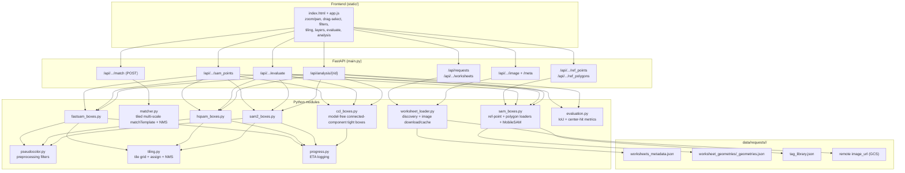

# Symbol Matcher — Complete Pipeline

End-to-end documentation of the worksheet symbol-detection system: how a request
image is loaded, how a user-selected symbol is matched everywhere, how the SAM
family (FastSAM / HQ-SAM / SAM 2.1 / MobileSAM) turns annotated reference points
into per-symbol boxes, and how those boxes are **evaluated** against ground
truth. The final section is a practical guide to **improving IoU**.

---

## 1. Overview

The tool lets you:

1. Pick a **request** (`rid`) and a **worksheet** (`wid`).
2. Load the worksheet raster (downloaded from its remote `image_url`).
3. **Drag a box** around a symbol → every visually similar patch is highlighted
   (classical template matching).
4. Or run a **SAM model** on the worksheet's annotated reference points → one
   tight bounding box per symbol, optionally with a **preprocessing filter** and
   **tiling**.
5. **Evaluate** a model's boxes against the ground truth (polygon patches by IoU,
   or reference points by center-hit) and read precision / recall / F1 / mean IoU.
6. **Analyse** a whole request — sweep several models × filters × GT modes across
   many sheets in one run.
7. Toggle result **layers** on/off to compare methods.

Three detection / scoring paths:

| Path | Prompt | Engine | Output |
|------|--------|--------|--------|
| **Template matching** | a drag-selected patch | Classical NCC (`cv2.matchTemplate`) · TMR · PerSAM (both training-free on the HQ-SAM backbone) | all similar patches |
| **SAM box-finding** | reference points from geometries | FastSAM / HQ-SAM / SAM 2.1 / MobileSAM | one box per symbol |
| **CCL box-finding** | reference points from geometries | Connected-component labeling (`cv2`, model-free) | one tight box per symbol |
| **Evaluation** | GT box centers *or* GT points | any box-finding model + `evaluation.py` | precision / recall / F1 / mean IoU + tagged overlay |

---

## 2. Architecture



`main.py` centralizes model dispatch in one helper, **`run_sam(...)`**, shared by
the `sam_points`, `evaluate` and `analysis` endpoints, so every path applies the
same crop / filter / tiling / grow-on-clip parameters consistently.

---

## 3. Data layout

```
data/requests/<rid>/
  worksheets_metadata.json          # worksheets; each has id, name, page_no, image{width,height,image_url}
  tag_library.json                  # tag id → name maps (used to resolve polygon categories)
  worksheet_geometries/
    <wid>_geometries.json           # annotated features: Point (type 1) refs + Polygon (type 3) patches
models/
  FastSAM-s.pt                      # FastSAM weights (auto-download)
  sam2.1_s.pt                       # SAM 2.1 small (auto-download)
  sam_hq_vit_tiny.pth               # Light HQ-SAM weights
  mobile_sam.pt                     # MobileSAM weights (optional)
symbol_matcher_app/.image_cache/    # decoded PNGs, keyed by <rid>__<wid>.png
```

---

## 4. Setup & run

Uses the existing `.envs/vsam` environment.

```bash
# from repo root — install deps into the vsam env
uv pip install --python .envs/vsam/bin/python -r symbol_matcher_app/requirements.txt

# run the server (from symbol_matcher_app/)
cd symbol_matcher_app
../.envs/vsam/bin/uvicorn main:app --reload --port 8000
# open http://127.0.0.1:8000/
```

Model weights are downloaded on first use (FastSAM, SAM 2.1) or expected in
`models/` (HQ-SAM, MobileSAM). SAM models are **lazy-loaded** — the heavy libs
import only the first time that model is requested, so startup and template
matching stay fast. Long loops print progress + ETA to the uvicorn console
(see §12).

---

## 5. Stage 1 — worksheet discovery & image loading

Module: `worksheet_loader.py`

1. **Discovery** — `list_requests()` scans `data/requests/*` for folders with a
   `worksheets_metadata.json`. `list_worksheets(rid)` returns every worksheet
   with an `image_url`, tagged with `has_geometry`, `page_no`, `width`, `height`.
   The list is **sorted geometry-first, then by page number**, so annotated
   sheets surface at the top of the searchable dropdown.
2. **Image load** — `load_worksheet_image(rid, wid)` returns a BGR `uint8` array.
   The raster is downloaded once from `image_url` (via `requests` + `PIL`),
   converted to BGR, and cached to `.image_cache/<rid>__<wid>.png`. Subsequent
   loads read the cache.
3. **Serving** — `/image` streams the cached PNG; `/meta` returns pixel
   `width`/`height` (the frontend maps screen ↔ image coords with these).
4. **PDF render (zoom)** — `render_pdf_image(rid, wid, zoom)` rasterizes the source
   `blueprint_file_url` page with PyMuPDF (`fitz`) at `zoom` x the base raster for
   sharper SAM processing (see §8.9). The PDF is disk-cached under `.image_cache/pdfs/`
   and each rendered zoom under `.image_cache/<rid>__<wid>__z<zoom>.png`.

---

## 6. Stage 2 — template matching (3 methods)

Endpoint: `POST /api/worksheet/{rid}/{wid}/match`

Input: the drag-selected rectangle (`x, y, w, h` in **original** image pixels), a
`threshold`, and a `method` (`"classical"` | `"tmr"` | `"persam"`). The server
crops that patch as the exemplar and dispatches on `method`. All three return the
same shape: `{ count, method, template, matches: [{x,y,w,h,score}] }`.

The UI exposes these as the **Method** dropdown in the *Template match* group
(Classical / TMR · SAM features / PerSAM · one-shot).

### 6.1 Classical (NCC) — `matcher.py`

Pixel-space normalized cross-correlation, **multi-scale + tiled + NMS**:

1. **Downscale guard** — image + template are scaled together so the longest
   side ≤ `max_image_dim` (2500 px); results are mapped back to full resolution.
2. **Multi-scale templates** — the template is pre-resized to scales
   `[0.8, 0.9, 1.0, 1.1, 1.25]` once and reused for every tile.
3. **Tiling** — the working image is split into overlapping tiles
   (`tile_size` ≈ 1024, overlap ≥ largest template + margin) so a boundary symbol
   is whole in some tile. Tiles run in parallel (`ThreadPoolExecutor`).
4. **Correlation** — per tile, `cv2.matchTemplate(..., TM_CCOEFF_NORMED)`; pixels
   ≥ `threshold` become candidate boxes.
5. **NMS** — greedy non-maximum suppression (`iou_thresh` 0.3) merges overlapping
   detections across tiles; survivors are rescaled to original pixels.

Fast and robust when instances look pixel-identical to the exemplar, but brittle
to rotation, contrast, and unseen sizes (only the listed scales are searched).

### 6.2 TMR & PerSAM — `feat_match.py` (training-free, SAM features)

Both reuse the **frozen HQ-SAM ViT encoder** (`hqsam_boxes.get_predictor`) — no
new weights, no fine-tuning. The sheet is covered with overlapping tiles (~1024 px
so the encoder's 64×64 grid stays ≈16 px/cell — fine enough for small CAD
symbols); each tile is encoded once (`get_image_embedding` → `[256,64,64]`), and
all boxes are merged with a global NMS.

**Scale consistency (critical):** a bare exemplar crop would be rescaled to 1024
by SAM and its feature cells would represent a totally different physical scale
than the target tiles. So the exemplar descriptor/kernel is sampled from the
**tile that contains the exemplar** (encoded at the same scale), reading the
feature cells over the exemplar box.

**Why different-sized instances are still found:** localization is driven by
*appearance similarity in feature space*, which is largely scale-agnostic (a peak
marks a symbol centre regardless of its size). The actual box extent comes from
the **SAM decoder mask** at that point — not from the correlation window — so
larger/smaller instances are detected and get correctly sized boxes.

**TMR (Template Matching & Regression, training-free flavour):**
1. Build a small **feature kernel** from the exemplar's foreground cells (per-cell
   L2-normalized, cropped to the exemplar's grid bbox).
2. Per tile: normalize the feature map per cell and slide the kernel over it as a
   **normalized cross-correlation** (`F.conv2d`) at several scales
   (`[0.75, 1.0, 1.5]`), taking the per-cell max — this is the "template matching"
   step in feature space.
3. Threshold + grid-NMS the correlation map to get peak cells; map each peak to a
   pixel centre and **refine with the SAM decoder** (positive point → best mask →
   tight bbox) — the "regression" step, done by the mask decoder rather than a
   learned box head.

**PerSAM (one-shot, training-free):**
1. Pool a **target embedding** = L2-normalized mean of the exemplar's foreground
   cell features.
2. Per tile: score every cell by **cosine similarity** to the target embedding
   (PerSAM "location confidence" map).
3. Threshold + grid-NMS → peaks; prompt SAM at each peak with a **positive point
   plus a negative point** placed at the tile's least-similar cell, so the mask
   latches onto the matched instance; the mask → tight bbox.

Notes: PerSAM cosine scores run lower than TMR correlation, so a **lower
threshold** (≈0.55–0.65) suits PerSAM while TMR tolerates ≈0.7. Both encode the
whole sheet, so they are seconds-scale (slower than classical) and log progress
via `progress.py`.

---

## 7. Stage 3 — ground truth (points & polygon patches)

Module: `sam_boxes.py`. Both are mapped from **Feathers canvas coords** to raster
pixels: scale by `sx = img_w/fe_w`, `sy = img_h/fe_h`, and **flip Y** via
`abs(y)` (Feathers is y-up).

### Reference points — `load_reference_points(rid, wid, w, h)`
- Iterate `outputs[].feature`, keep **`geometry_type == 1` (Point)** features
  ("electrical" filtering, matching the EDA notebooks).
- Drop points outside the raster → `RefPoint(x, y, name)` list.
- Exposed at `GET /ref_points`; these are the default SAM prompts.

### Polygon "true patches" — `load_reference_polygons(rid, wid, w, h, electrical=True)`
- Keep **`geometry_type == 3` (Polygon)** features; reduce each outer ring to a
  bounding box → `RefPolygon(x, y, w, h, name)`.
- With `electrical=True` (default) apply the **wiring-only** filter `_poly_keep`:
  resolve the polygon's tags via `tag_library.json` and keep it **only when its
  `category` is `WIRING_DEVICES`** — lighting, panels, fire-alarm, security, etc.
  are dropped. This isolates the wiring symbols we score against.
- Exposed at `GET /ref_polygons?electrical=1`.
- `worksheet_has_patches(rid, wid)` is a cheap existence check used to offer the
  **"Only sheets with patches"** filter and to pick sheets for the analysis sweep.

---

## 8. Stage 4 — SAM box-finding

Endpoint: `GET /api/worksheet/{rid}/{wid}/sam_points?model=<...>&limit=N&...`

Sheets are huge and symbols tiny, so a whole-sheet model downscales symbols to a
few pixels and produces loose masks. Every non-legacy SAM path is therefore
**crop-wise**: a small window is cut around each reference point so the symbol
fills the patch.

### 8.1 Preprocessing filters — `pseudocolor.py`

A single `preprocess(image, filt, ksize, kernels)` is applied to **the model
input only**; the connected-component fallback and all box coordinates keep using
the original BGR frame, so geometry is never distorted. Available `filt` values:

| `filt` | What it does | Uses |
|--------|--------------|------|
| `none` | unchanged | — |
| `gaussian` | Gaussian blur | `ksize` |
| `laplace` | Laplacian-of-Gaussian edges (bright strokes on dark) | `ksize` (pre-blur) |
| `channels` | multi-scale per-channel pseudo-color "glow" (`invert=True`, `keep_black=True`) | `kernels` = R/G/B kernels |
| `sharpen` | unsharp mask (deliberately aggressive) | `ksize` (radius) |
| `median` | median blur (kills speckle) | `ksize` |
| `bilateral` | edge-preserving smoothing | `ksize` (diameter) |
| `canny` | Canny edge map | — |
| `clahe` | local contrast enhancement | `ksize` (tile) |
| `threshold` | adaptive Gaussian binarization | `ksize` (block) |
| `invert` | intensity inversion | — |

**Why `channels` exists:** SAM-family models are trained on natural photos and
struggle with razor-thin, 1-px monochrome CAD lines. Blurring each channel with a
different Gaussian kernel (Red tight → sharp boundaries, Green mid → local
context, Blue wide → broad "glow") produces a coloured chromatic-aberration halo
around every line that SAM's patch-attention perceives like natural depth /
lighting. UI R/G/B kernels default to `6 / 8 / 3`. With `keep_black=True` the
sharp original ink is composited back (glow scaled by `alpha = gray/255`), so the
**line core stays solid black in all three channels** and the colour survives only
as a halo around it — a black line with a coloured glow rather than a fully
colour-filled stroke.

### 8.2 Shared crop recipe

For each reference point:

1. **Fixed crop** *(all models)* — a fixed `crop` half-window is taken around every
   reference point (like the notebook). There is no nearest-neighbour adaptation.
2. **Grow-on-clip** *(HQ-SAM, SAM 2.1, non-tiled)* — the crop **starts small**
   (`start_crop_frac × adaptive size`) so the box hugs the symbol, and is only
   re-run at a larger size (`× grow_factor`, up to `max_grows` times) if the mask
   **touches the crop edge** (symbol clipped). Smaller `start_crop_frac` → tighter
   boxes / higher IoU.
3. **Preprocessing** — the crop fed to the model is filtered per §8.1.
4. **Model inference** on the crop.
5. **Candidate selection** — keep masks that cover the point and aren't
   background-sized; prefer masks within `max_symbol_px`, then higher score, then
   smaller.
6. **Finalize** — add `pad` on every side, floor the box to `min_symbol_px`, clamp
   to image bounds. *(These two knobs are the dominant IoU lever — see §13.)*
7. **Fallback** — if no mask is found, a dark **connected-component** box under the
   point is used (`source = "cc"`).

### 8.3 FastSAM — `fastsam_boxes.py` (cyan)

YOLOv8-seg "segment everything" on the crop (`retina_masks=True`). Then, via
`_covering_masks` / `_select_from_covering`:

- collect **every** non-background mask that covers the point,
- **union** only those near the **median** mask size (`size_ratio = 1.6 × median`)
  — this merges fragmented sub-strokes into the whole symbol while dropping an
  oversized enveloping mask,
- if that union still exceeds `max_symbol_px`, fall back to the **smallest**
  covering mask.

FastSAM has **no grow-on-clip** (it's a detector, not a point-encoder). Fastest
model.

### 8.4 HQ-SAM — `hqsam_boxes.py` (magenta)

Light HQ-SAM (`vit_tiny` backbone + high-quality mask head). Dense-region tuned:

- **adaptive crop** + **grow-on-clip** (§8.2),
- neighbouring reference points fed as **negative** prompts (`max_negatives = 8`)
  so the mask stops at the gap between adjacent symbols,
- a two-pass **refinement** (`predict_ctx`): pass-1 (`multimask_output=True`,
  `hq_token_only=True`) proposes a mask; pass-2 feeds its logits back **with the
  negatives** (`multimask_output=False`) to sharpen the boundary,
- CC fallback on misses.

Weights load with `map_location="cpu"` so a CUDA-saved checkpoint runs on
MPS/CPU. Crispest on thin symbols; ~0.15 s/point.

### 8.5 SAM 2.1 — `sam2_boxes.py` (amber)

SAM 2.1 Hiera-small via **Ultralytics** — the SAM-family model that runs on Apple
**MPS**, used as the Mac-friendly stand-in for SAM 3. Same adaptive-crop +
grow-on-clip + neighbour-negative recipe. **Per-point only** (no tiling).
Heaviest (~0.47 s/point, re-encodes each crop).

### 8.6 Mix (HQ+Fast) — `mix_boxes.py` (`model=mix`, purple)

Runs **both FastSAM and HQ-SAM** over the **same reference points** and merges
**per centre**:

- for each point, take that point's FastSAM box and its HQ-SAM box and keep the
  one with the **smaller area** (tighter) — HQ-SAM is usually crisper, FastSAM
  occasionally tighter, so we take whichever hugs the symbol more,
- if only one model produced a box for that point, that box is kept (the "OR").

Because `boxes_from_points` returns a flat list that skips misses (and reorders
in tiled mode), each returned box is first mapped back to its reference point
(the point inside the box nearest its centre, else the globally nearest point)
before the per-point comparison.

HQ-SAM runs here (and everywhere) with a **larger margin** — `pad +
hqsam_boxes.HQ_EXTRA_PAD` (`HQ_EXTRA_PAD = 3`) — because its masks hug the ink
tightly and can clip the symbol. Tiling and grow-on-clip pass through to the two
underlying models. Cost is roughly the sum of both models' per-point times.

### 8.7 MobileSAM — `sam_boxes.py` (legacy, `model=mobilesam`)

Whole-image `set_image` once, then per-point `predict`. Simple but loose in dense
regions (why FastSAM/HQ-SAM were added). Kept for comparison.

### 8.7b CCL — `ccl_boxes.py` (`model=ccl`, coral) — model-free

A **connected-component-labeling** tight-box finder — the classical counterpart
to the SAM family: no weights, no network, deterministic, and thousands of
points per second. The SAM modules already carry a single-component
`_cc_fallback` for misses; this promotes CCL to a first-class method that merges
a symbol's disconnected strokes into one box and recenters onto the nearest ink.
Ported from the EDA recipe in `eda/notebooks/electrical_data_testing.ipynb`
(Otsu binarize → CCL → shrink-wrap bbox). Per reference point:

1. **Crop** ± `crop` (48) px around the point.
2. **Binarize** — Otsu inverse (dark ink → foreground); optional adaptive
   threshold via `block`.
3. **Cut wires** (`_remove_wires`) — electrical plans wire everything together,
   so a raw connected component under a point is usually the *whole wiring
   network* (its bbox fills the crop). A morphological **opening** with a long
   1-D kernel (`line_len ≈ 0.6 × max_symbol_px`) isolates straight horizontal /
   vertical runs; subtracting them breaks the wire so the compact glyph survives
   as its own component. Symbol strokes are shorter than `line_len` so they stay.
4. **Close** (`close_ksize` 3) — reconnect the symbol's own thin sub-strokes.
5. **Label** (`cv2.connectedComponentsWithStats`, 8-connectivity) and keep only
   **compact glyph-like** components (`_compact_candidates`): dropped if bigger
   than `max_symbol_px` (48), spanning >92 % of the crop (a through-structure),
   too elongated (`aspect > max_aspect` 6 — a leftover diagonal line), or speckle
   (`area < min_area`).
6. **Seed** on the candidate under the point (snapping to the nearest candidate
   within `search` px when the point sits just off the ink), then **region-grow**
   over neighbouring glyph components within `merge_gap` (1) px, bounded by the
   per-symbol window (`± max_symbol_px`) so it merges a symbol's strokes without
   walking onto the adjacent circuit-number text.
7. **Finalize** — pad, floor to `min_symbol_px`, clamp to image (same recipe as
   the SAM modules).

CCL keeps its **own tuned crop / `max_symbol_px` geometry** (it doesn't take the
looser SAM defaults); only the UI box-fit levers `pad` and `min_symbol_px` are
forwarded from `sam_points` / `evaluate`. No preprocessing filter, tiling,
grow-on-clip or SAM weights apply. When **prompted at GT box centers** it is very
tight — **mean IoU ≈ 0.87** on wiring patches (above the SAM ~0.72 plateau of
§18) with ~97 % center-hit — because the box is the ink's own bounding box rather
than an inflated mask. Coverage from free reference points is lower than the SAM
models (~60 %) since symbols fused to a wire (or drawn purely as part of one) are
removed with the wire; it excels as a **tightness baseline** and a fast,
weight-free option.

### 8.8 Hybrid tiling & stitching — `tiling.py`

`tile > 0` switches **FastSAM / HQ-SAM** to a hybrid path that avoids re-encoding
heavily overlapping crops:

1. **`tile_grid(w, h, tile, overlap=96)`** covers the sheet with overlapping
   square tiles (a final tile is flushed to each far edge for full coverage).
2. **`assign_points_to_tiles`** maps each point to **exactly one** tile — the one
   where it sits **most interior** (largest min-distance to the tile edges) — so
   boundary symbols land in a tile that fully contains them and each point is
   analysed once.
3. Each tile is **encoded once** (`set_image` / a single FastSAM pass); every
   point in it is decoded against that encoding.
4. **`nms_boxes`** stitches all tiles' boxes with a global greedy NMS (`nms_iou`,
   default 0.5), deduping overlaps in the shared regions.

Note: grow-on-clip does **not** apply in tiled mode (the encoding is shared per
tile). Tiling trades a little per-symbol resolution for far fewer passes.

### 8.9 Render zoom (quill_forge / fitz) — `worksheet_loader.render_pdf_image`

`zoom > 1` re-renders the sheet from its **source PDF** (`blueprint_file_url`,
`page_no`) with PyMuPDF at `fitz.Matrix(sx, sy)` — quill_forge's zoom method —
instead of using the pre-rendered `image_url`. The render is sized to exactly
`base_width*zoom x base_height*zoom` (and disk-cached per rid/wid/zoom), so the
crisper vector lines help SAM on thin symbols.

It affects **processing only** (`run_sam`): the model runs on the zoomed image and
the resulting boxes are **mapped back to base-raster pixels** (`/zoom`). Reference
points and the pixel-size knobs (`crop`, `min_symbol_px`, `max_symbol_px`, `pad`,
`tile`) are scaled by `zoom` internally, so their effect in base pixels is
unchanged and GT overlays / evaluation stay in the base coordinate system. The
displayed image and the points/patches layers are untouched. Cost/memory grow with
`zoom^2` (a 7000x5000 sheet at 2x is 140 MP; UI offers 1×–5×).

**Remove text (`remove_text=True`):** before rasterizing, every text *word* on the
page is covered with a redaction box and `apply_redactions(images=PDF_REDACT_IMAGE_NONE,
graphics=PDF_REDACT_LINE_ART_NONE)` strips only the text — **vector line art and
raster images are kept** (recipe from `eda/notebooks/pdf_renderring.ipynb`). This
removes label/dimension clutter that otherwise distracts the detector (on a sample
sheet ~74% of the dark ink was text). It forces the PDF-render path even at
`zoom = 1` and is cached separately (a `_nt` tag on the cache key). Exposed as the
**Remove text** checkbox in the SAM boxes group and the Analysis section; the
`sam_points`, `evaluate` and `analysis` endpoints accept `remove_text=1`.

Output: `{ model, count, total_points, used_points, boxes:[{x,y,w,h,score,name,source}], points:[...] }`.

---

## 9. Stage 5 — evaluation

Endpoint: `GET /api/worksheet/{rid}/{wid}/evaluate` · Module: `evaluation.py`

The model is **prompted at the ground truth itself** and scored against it. Two
`gt` modes:

### `gt="bboxes"` (default) — IoU against wiring polygons
1. Prompt the model at the **center of each wiring-filtered GT polygon**
   (`RefPoint(x + w/2, y + h/2)`).
2. `evaluate(pred, gt, iou_thr)` reports two blocks:
   - **BBox IoU** — predictions greedily matched to GT boxes by IoU ≥ `iou_thr`;
     precision / recall / F1 plus **`mean_iou`** of matched pairs (how tightly the
     boxes line up). **This is the primary number and what §13 optimizes.**
   - **Center hit** (informational) — a GT is "found" if some prediction contains
     its center; a prediction is a hit if it contains a GT center.
3. Each prediction is tagged **`tp`/`fp`** (IoU-based) and each GT
   **`matched`/`missed`** for the overlay.

### `gt="points"` — center-hit against reference points
1. Prompt at (and score against) the electrical **reference points**.
2. `evaluate_points(pred, points)` scores by **containment** only (IoU is
   undefined for points): a point is found if a prediction contains it; a
   prediction is a TP if it contains ≥ 1 point. Returns a zeroed IoU block so the
   UI/analysis can treat both modes uniformly.

Box-fit defaults are **tighter here** than the interactive endpoint (`pad=1`,
`min_symbol_px=16` vs `4` / `28`) because evaluation is about box fit. HQ-SAM /
SAM 2.1 also accept `grow_on_clip` / `start_crop_frac`.

Returns `{ metrics, boxes:[{...,status}], gt:[{...,status}] }`.

---

## 10. Stage 6 — analysis sweep

Endpoint: `GET /api/analysis/{rid}` · dispatch via the same `run_sam` + `evaluation`.

Aggregates evaluation across the request's patch-bearing sheets (up to
`max_sheets`). `models`, `filt` and `gt` are each **comma-separated**, so one run
sweeps every **model × filter × GT** combination:

- Decoded images + GT points/polygons are **cached per worksheet**, so the sweep
  doesn't redo that work for each combination.
- For each combination it evaluates every sheet, then reports **micro-averaged**
  precision / recall / F1 (and `mean_iou` for bbox mode) plus a per-sheet
  breakdown.
- Kernel sizes (`ksize`, `kr`, `kg`, `kb`) and `tile` are shared across the sweep.

Returns `{ rid, iou_thr, n_sheets, results:[{label, model, filt, gt_mode, center, iou, sheets:[...]}] }`.

This is the tool for **systematically finding the config that maximizes IoU**.

---

## 11. API reference

| Method | Path | Purpose |
|--------|------|---------|
| GET | `/api/requests` | list request ids (`rid`) |
| GET | `/api/requests/{rid}/worksheets` | worksheets (geometry-first); `?patches_only=1` keeps only sheets with wiring patches |
| GET | `/api/worksheet/{rid}/{wid}/image` | worksheet PNG (disk-cached) |
| GET | `/api/worksheet/{rid}/{wid}/meta` | `{ width, height }` in pixels |
| GET | `/api/worksheet/{rid}/{wid}/ref_points` | GT reference points (Point features) |
| GET | `/api/worksheet/{rid}/{wid}/ref_polygons` | GT polygon patches; `?electrical=1` = wiring only |
| POST | `/api/worksheet/{rid}/{wid}/match` | template matches for a selected patch; body `method`: `classical` \| `tmr` \| `persam` |
| GET | `/api/worksheet/{rid}/{wid}/sam_points` | SAM boxes from reference points |
| GET | `/api/worksheet/{rid}/{wid}/evaluate` | score a model vs GT (IoU or center-hit) |
| GET | `/api/analysis/{rid}` | sweep models × filters × GT over many sheets |

Common SAM/eval query params (`run_sam`): `model` = `fastsam`\|`hqsam`\|`sam2`\|
`mix`\|`ccl`\|`mobilesam`; `limit`; `crop`, `min_symbol_px`, `max_symbol_px`, `pad` (box
sizing); `filt` + `ksize`/`kr`/`kg`/`kb` (preprocessing); `tile` + `nms_iou`
(hybrid tiling, FastSAM/HQ-SAM); `grow_on_clip` + `start_crop_frac` (HQ-SAM /
SAM 2.1); `zoom` > 1 (quill_forge / fitz PDF render for sharper processing, boxes
mapped back to base pixels). `evaluate` adds `gt` (`bboxes`\|`points`) and
`iou_thr`; `analysis` takes comma-separated `models`/`filt`/`gt` plus `max_sheets`.

---

## 12. Progress logging — `progress.py`

Long loops (per-point SAM, tiled SAM, the analysis sweep) wrap a `Progress`
counter that logs to the uvicorn console:

```
22:52:36 [symbol_matcher] HQ-SAM 323pts: 320/323 (99%) · elapsed 1m10s · ETA 1s
22:52:36 [symbol_matcher] HQ-SAM 323pts: complete — 323/323 in 1m11s (4.5/s)
```

A line prints on the first item, then every `every` items or `every_secs`
seconds (whichever first), and once when the loop finishes — so you always see
percent-done and an ETA for slow runs.

---

## 13. Frontend / UI

Files: `static/index.html`, `static/app.js`, `static/style.css`
(asset links are versioned — `?v=N` — so bumping `N` forces a cache refresh).

- **Selection & panning** — left-drag pans; click **Select symbol** to draw a box
  (auto-reverts to pan). Space / middle / right mouse also pan.
- **Zoom** — scroll wheel (tuned) + `−` / `+` / `Fit` / `1:1`.
- **Multiple selections** — each drag adds a color-coded selection; **Re-match**
  re-runs all; **Clear** resets.
- **Template match group** — a **Method** dropdown (Classical NCC / TMR · SAM
  features / PerSAM · one-shot) + **Threshold** slider. TMR/PerSAM encode the sheet
  with the HQ-SAM backbone (slower; status shows an "encoding…" note).
- **SAM boxes group** — **FastSAM / HQ-SAM / SAM 2.1 / Mix / CCL (classical)**
  buttons, a **Tiling** dropdown (Off / 512 / 640 / 768 / 1024), a **Render zoom**
  selector (1×–5×), and a **Remove text** checkbox (redact text before processing).
  CCL is model-free — it ignores the filter / tiling / zoom controls.
- **Evaluate group** — **Model**, **GT** (BBoxes·IoU / Points·center), **Eval
  filter** (independent of the interactive filter), **IoU** threshold, and the
  box-fit knobs **Pad**, **Min px**, **Grow-on-clip** + **Start crop** (the last
  two dim for FastSAM). Results render as a precision/recall/F1 (+ mean IoU) table.
- **SAM preprocessing filter group** — the filter for the interactive SAM buttons,
  with a **Kernel** field and per-channel **R / G / B** fields (shown only for the
  relevant filter). Kernel values are shared by the eval/analysis filters too.
- **Layers panel** — checkboxes + live counts for **Points / Patches / Matches /
  FastSAM / HQ-SAM / SAM 2.1 / Mix / CCL / Eval TP / Eval FP / Missed GT**.
  Toggling only shows/hides (no re-run).
- **Overlay rendering** — SVG rects with **non-scaling strokes** (crisp at any
  zoom). Predicted / eval boxes get a **translucent fill** so tiny boxes stay
  visible on a huge sheet; matched GT is outline-only; missed GT is dashed (or a
  cross in points mode).
- **Analysis section** — **Models** checkboxes, **GT** checkboxes, **Filters (tick
  any)** checkbox grid, **IoU**, **Max sheets**, **Tiling**, **Render zoom**, a
  **Remove text** checkbox, and a results table per combination.

---

## 14. Models & weights

| Model | Mode | File | Source | Notes |
|-------|------|------|--------|-------|
| FastSAM-s | `fastsam` | `models/FastSAM-s.pt` | ultralytics (auto) | default, fastest, tiling ✔, grow ✘ |
| Light HQ-SAM | `hqsam` | `models/sam_hq_vit_tiny.pth` | huggingface.co/lkeab/hq-sam | crispest on thin symbols, tiling ✔, grow ✔ |
| SAM 2.1 small | `sam2` | `models/sam2.1_s.pt` | ultralytics (auto) | Mac/MPS-friendly, per-point only, grow ✔ |
| Mix (HQ+Fast) | `mix` | — | FastSAM + HQ-SAM | per-point: keep smaller-area box; HQ-SAM `pad + HQ_EXTRA_PAD` |
| CCL (classical) | `ccl` | — | OpenCV connected components | **model-free**, instant, tightest boxes (mean IoU ~0.87); no tiling/grow/filter |
| MobileSAM | `mobilesam` | `models/mobile_sam.pt` | MobileSAM repo | legacy |

---

## 15. SAM 3 status (not wired in)

SAM 3 (`srcs/sam3`) is a text/exemplar **concept** segmenter but is **not usable
on this Mac**:

1. **MPS abort** — even with `PYTORCH_ENABLE_MPS_FALLBACK=1`, a forward pass
   aborts with `MPSNDArrayMatrixMultiplication ... cannot have different
   datatype` (SIGABRT). CPU-only would be very slow.
2. **Weights** — official `facebook/sam3` is gated, and the local
   `best_stg1(1).pth` uses `backbone.dinov3.*` naming that doesn't match the
   installed builder (`backbone.vision_backbone.trunk.*`).

**SAM 2.1 (`model=sam2`) is the Mac-friendly substitute.** Run SAM 3 itself on a
CUDA machine with proper weights per `srcs/sam3/examples/`.

---

## 16. End-to-end walkthrough

1. **Browser** loads `/` → `GET /api/requests` fills the rid dropdown.
2. Pick a rid → `GET /api/requests/{rid}/worksheets` fills the searchable wid list
   (geometry sheets first; optionally patches-only).
3. Pick a wid → **Load worksheet** → `GET /meta` then `GET /image`; `ref_points`
   and `ref_polygons` layers load.
4. **Template path**: *Select symbol*, drag a box → `POST /match` → matches drawn.
5. **SAM path**: pick a filter/tiling, click *FastSAM/HQ-SAM/SAM 2.1* →
   `GET /sam_points` → boxes drawn in the model's color.
6. **Evaluate**: choose model / GT / filter / IoU / box-fit knobs → `GET /evaluate`
   → metrics + tp/fp/missed overlay.
7. **Analyse**: tick models/filters/GT → `GET /analysis/{rid}` → per-combination
   tables to compare configs.

---

## 17. Key tuning knobs

| Where | Param | Default | Effect |
|-------|-------|---------|--------|
| `matcher.match_template` (classical) | `threshold` | 0.7 | correlation cut-off (higher = stricter) |
| | `scales` | 0.8–1.25 | template sizes searched |
| | `max_image_dim` | 2500 | working resolution (speed vs accuracy) |
| `feat_match.match_template` (tmr/persam) | `threshold` | 0.7 (persam ≈0.55–0.65) | feature cosine/correlation cut-off |
| | `scales` | 0.75–1.5 | TMR kernel scales searched |
| | `tile` / `overlap` | 1024 / 128 | dense-feature tiling of the sheet |
| | `min_symbol_px` / `max_symbol_px` | 6 / 220 | decoder mask size gate |
| | `pad` | 2 | margin per side on refined boxes |
| SAM (`run_sam` / `boxes_from_points`) | `crop` | 90 | fixed half-window around a point |
| | **`pad`** | 4 (sam) / **1 (eval)** | margin per side — **big IoU lever** |
| | **`min_symbol_px`** | 28 (sam) / **16 (eval)** | box size floor — **big IoU lever** |
| | `max_symbol_px` | 90 | box size ceiling |
| | `size_ratio` | 1.6 | FastSAM: union masks within ×median |
| `ccl_boxes.boxes_from_points` (`model=ccl`) | `crop` | 48 | half-window around a point |
| | `max_symbol_px` | 48 | glyph size cap + grow window (±) |
| | `line_len` | 0.6×max | wire-cut opening length (drops longer straight runs) |
| | `close_ksize` | 3 | close kernel bridging a symbol's sub-strokes |
| | `merge_gap` | 1 | max gap (px) to merge neighbouring glyph components |
| | `max_aspect` | 6 | drop elongated line leftovers |
| | `max_negatives` | 8 | neighbour negative prompts (HQ/SAM2) |
| | **`grow_on_clip`** | True | HQ/SAM2: start small, grow only if clipped |
| | **`start_crop_frac`** | 0.5 (eval UI 0.4) | HQ/SAM2: initial crop fraction — smaller = tighter |
| | `tile` / `tile_overlap` / `nms_iou` | 0 / 96 / 0.5 | hybrid tiling (FastSAM/HQ-SAM) |
| | `zoom` | 1 | quill_forge/fitz PDF render factor for processing (1×–5×; boxes mapped back to base) |
| | `remove_text` | False | render from PDF with text redacted (line art kept) — de-clutters the input |
| `pseudocolor.preprocess` | `filt` / `ksize` / `kernels` | none / 5 / (6,8,3) | preprocessing fed to the model input |
| `evaluate` | `gt` / `iou_thr` | bboxes / 0.5 | GT source & IoU match threshold |

---

## 18. How to improve IoU

Mean IoU measures how tightly each predicted box lines up with its GT box. On
this data the GT wiring symbols are **small (~18–31 px per side)**, so IoU is
usually limited by **box tightness**, not detection.

### Why IoU plateaus (~0.72)
`finalize()` inflates the mask bbox two ways: it **adds `pad` on every side**
(+`2·pad` px) and **floors the box to `min_symbol_px`**. With the old defaults
(`pad=4`, `min=28`) a genuine 23×27 symbol becomes ~28–30 px, capping IoU at
`(23·27)/(28·30) ≈ 0.74` even when perfectly centered. That's the plateau.

### Levers, in order of impact
1. **Shrink `pad` and lower `min_symbol_px`** *(biggest win)*. These are exposed in
   the **Evaluate group** (Pad / Min px), defaulting to the tighter `1` / `16`.
   Try `pad=0` and `min≈16`; drop `min` further only if symbols are tiny.
2. **HQ-SAM with a small `start_crop_frac`** *(grow-on-clip)*. HQ-SAM produces
   crisper masks than FastSAM's median-union, and starting the crop small
   (`0.3–0.4`) yields tighter boxes; it only enlarges when a mask clips the edge,
   so recall is preserved. Set via the **Grow-on-clip** + **Start crop** controls.
3. **Preprocessing filter**. A crisper input often tightens the mask boundary by a
   pixel or two — try `sharpen`, `channels`, `laplace` in the **Eval filter** (or
   compare several at once in Analysis).
4. **Tighter FastSAM selection**. If staying on FastSAM, lowering `size_ratio`
   (currently 1.6) makes the median-union less likely to swallow an oversized
   neighbour mask; over-segmented boxes (mask grabbed too much → FP) shrink.
5. **Snap-to-ink** — this is exactly what **CCL (`model=ccl`)** does natively: the
   box is the ink's own connected-component bbox, so prompted at GT centers it
   reaches **mean IoU ≈ 0.87** (above the SAM plateau). Use it as the tightness
   reference / upper bound, and as a fast weight-free option when a symbol isn't
   fused to its wire. It's also the model to reach for when GPU/weights aren't
   available.

### Method
Use the **Analysis** sweep to compare configs objectively rather than eyeballing a
single sheet: tick FastSAM + HQ-SAM and a few filters, run across several sheets,
and read the **mean IoU** column. Then:
- Watch **recall vs mean IoU**: shrinking boxes too far starts dropping the
  IoU-threshold matches (recall falls). The sweet spot is the smallest
  `pad` / `min` / `start_crop_frac` that keeps recall flat while mean IoU climbs.
- Tiling is **not** an IoU lever — it's about speed/dedup; it can slightly *lower*
  per-symbol resolution, so evaluate crop-per-point when chasing IoU.

### Ceiling caveat
If the GT polygons themselves include surrounding whitespace or a label, no amount
of prediction tightening passes ~0.8 — the ceiling is set by GT box quality.
Verify a few GT boxes hug the drawn symbol before pushing further.

---

*Modules:* `main.py`, `worksheet_loader.py`, `matcher.py`, `sam_boxes.py`,
`pseudocolor.py`, `fastsam_boxes.py`, `hqsam_boxes.py`, `sam2_boxes.py`,
`ccl_boxes.py`, `mix_boxes.py`, `tiling.py`, `evaluation.py`, `progress.py`,
`static/`.
