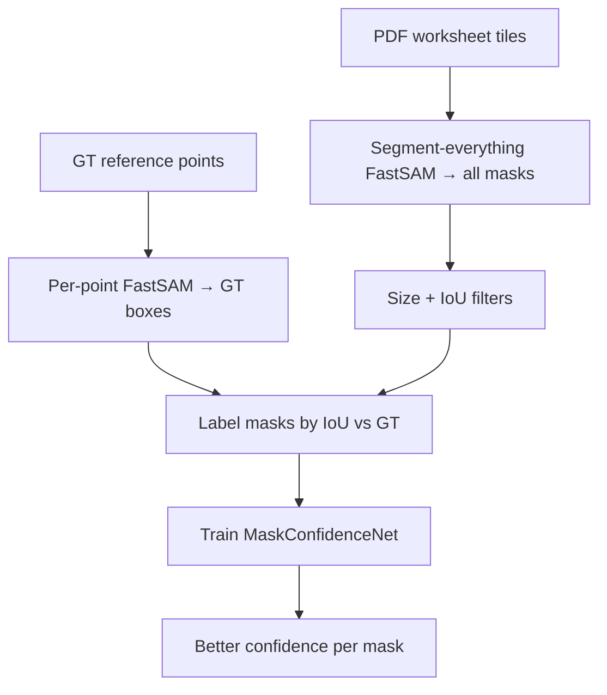

# Technical Architecture

How electrical symbols are detected, labeled, and re-scored in this pipeline.

---

## The Big Picture

We use **FastSAM** (frozen, not trained) to find symbol shapes on worksheet PDFs. It runs in two ways:

1. **Per-point** — given a known reference point, crop around it and find the symbol box there. This powers the live app and creates **ground-truth (GT) boxes**.
2. **Whole-sheet scan** — chop the sheet into tiles, run segment-everything on each tile, collect every mask FastSAM proposes. This powers **finetune dataset prep**.

FastSAM's raw confidence (YOLO objectness) is weak for symbols. So we train a small CNN called **MaskConfidenceNet** that learns a better score for each mask. FastSAM still finds masks; the head only re-scores them.



---

## 1. GT Boxes from Points

**Goal:** Turn annotated reference points `(x, y)` into tight bounding boxes around each symbol.

**Flow:** `main.py` → `boxes_from_points.py` → `seg_models.FastAdapter`

### What happens per point

1. Load electrical reference points from the worksheet.
2. Render the PDF at 4× zoom (text removed so labels don't confuse the model).
3. For each point, take a **crop** around it (default half-window ≈ 90px base, scaled by zoom).
4. Run FastSAM segment-everything on that crop.
5. Keep masks that **cover the point** and aren't huge background blobs.
6. Union similar-sized masks and fit a tight box to the mask pixels.
7. Return one `SamBox(x, y, w, h)` per point.

```python
# seg_models.py — core per-point call
res = model(_fastsam_rgb(crop), imgsz=1024, conf=0.25, iou=0.9, retina_masks=True)[0]
covering = _covering_masks(res, cx, cy, ...)      # masks that contain the point
box = _select_from_covering(covering, ...)         # union + tight bbox from mask pixels
```

### How it filters

- **Drop** masks that don't contain the prompt point.
- **Drop** masks whose bbox is too large (background / wire runs).
- Among remaining masks: union ones near the median size; if the result is still too big, use the smallest mask instead.

### Zoom handling (`main.py`)

At 4× zoom, point coords and crop sizes are scaled up for rendering, then boxes are mapped back to base pixels for the UI:

```python
zpts = [RefPoint(int(p.x * Z), int(p.y * Z), p.name) for p in points]
boxes = bfp.boxes_from_points(..., crop=crop * Z, ...)
# then: box coords /= Z
```

Finetune reuses the same `boxes_from_points` call for GT but keeps boxes in rendered space (no divide-back), since the tile scan runs in the same coords.

---

## 2. Finetune Dataset Prep

**Goal:** Build training data to teach MaskConfidenceNet which FastSAM masks are real symbols.

**Module:** `finetune/prep_dataset.py`

### Step-by-step

**A. Get GT boxes** — run the per-point pipeline (§1) at every electrical reference point on the sheet.

**B. Scan the whole sheet** — render 1024×1024 overlapping tiles (128px overlap), run frozen FastSAM on each:

```python
bres = model([_fastsam_rgb(c) for c in batch_crops], imgsz=1024, conf=0.25, iou=0.9, retina_masks=True)
# each result → many masks + objectness scores
```

**C. Filter candidates** — for each mask on a tile:

| Check | Rule | Why |
|-------|------|-----|
| Too small | min side < 12px | noise / slivers |
| Too big | area > 10% of tile | background blobs |

**D. Label by IoU** — compare each candidate bbox to the nearest GT box:

| IoU with GT | Label |
|-------------|-------|
| ≥ 0.5 | **Positive** — real symbol |
| < 0.1 | **Negative** — not a symbol |
| 0.1 – 0.5 | **Dropped** — too ambiguous to train on |

**E. Balance negatives** — keep all positives + 4 negatives per positive (mix of hard near-misses and random).

**F. Cache crops** — for each kept mask, save a centroid-centered grayscale window + mask to `.npz`, record label in `manifest.jsonl`.

---

## 3. MaskConfidenceNet

**Goal:** Replace FastSAM's raw objectness with a learned, calibrated confidence.

FastSAM stays frozen. Only this small CNN is trained.

### What it sees (per mask)

A 128×128 input with 3 channels:

```python
# features.py
# ch0: grayscale crop around the mask centroid
# ch1: the binary FastSAM mask
# ch2: Gaussian dot at the centroid
```

Plus 4 numbers: FastSAM conf, relative mask size, aspect ratio, fill ratio.

### What it does

Small conv net → pool features **inside the mask** (so overlapping masks in the same crop get different scores) → fuse with the 4 numbers → output one logit → sigmoid = confidence in [0, 1].

```python
# model.py — simplified
masked_pool = pool_conv_features_inside_mask(x)
confidence = sigmoid(head(concat(masked_pool, global_pool, scalar_feats)) / temperature)
```

### What it does NOT do

- Does not find new masks (FastSAM does that).
- Does not filter during dataset prep (size gate + IoU band do that upstream).
- At inference/viz, you *can* threshold on head score (`--min-score`) to hide low-confidence masks.

---

## 4. Full Pipeline (One Line)

```
PDF → GT boxes from points + tiled FastSAM scan → filter → IoU label → cache crops → train head → better mask scores
```

---

## Key Files

| File | What it does |
|------|--------------|
| `main.py` | API + `run_sam()` entry point |
| `boxes_from_points.py` | Per-point detection loop |
| `seg_models.py` | FastSAM adapter + mask selection |
| `finetune/prep_dataset.py` | Build labeled dataset |
| `finetune/model.py` | MaskConfidenceNet |
| `finetune/infer.py` | Score masks at inference |

For run commands see `finetune/README.md`. For plugging the head into the live app see `finetune/integrate.md`.
